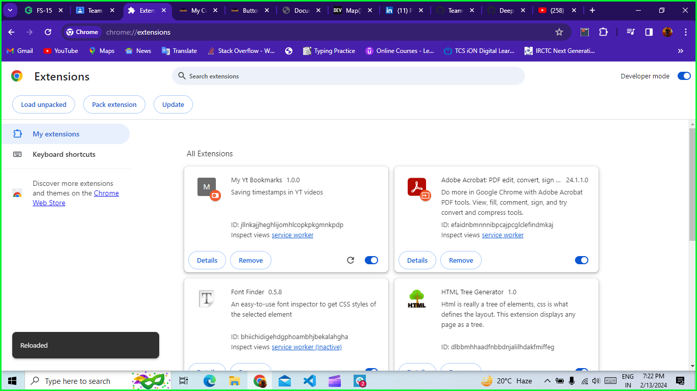
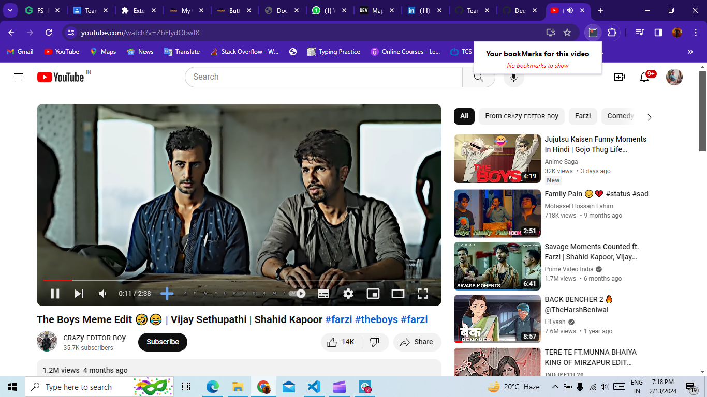
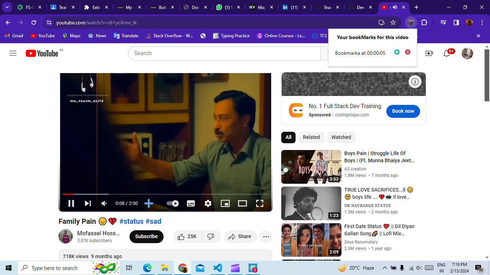
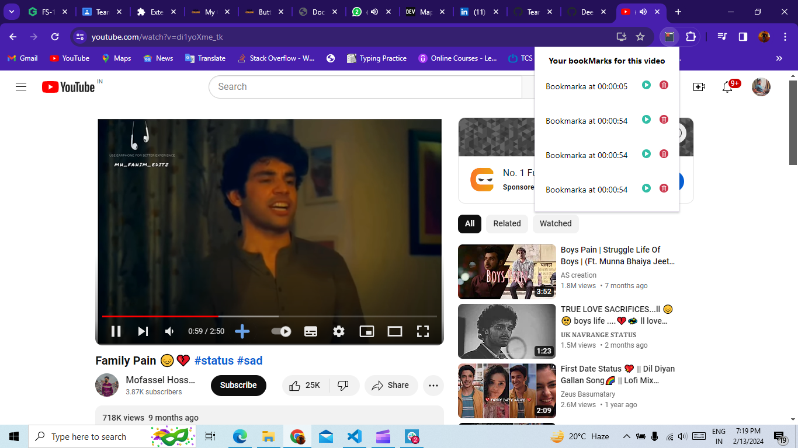

# YouTube Timeline Bookmarker Chrome Extension

## Description

YouTube Timeline Bookmarker is a Chrome extension that simplifies bookmarking YouTube videos by saving specific intervals of the video timeline. It allows users to jump directly to these bookmarked intervals, facilitating the resumption of videos added to the 'Watch Later' list or the creation of important notes during lectures. Additionally, users can easily bookmark the beginning of their favorite songs for quick access.

## Installation

1. Clone or download the repository to your local machine.
   ```
   git clone https://github.com/Deep1416/Team-16
   ```
2. Open Google Chrome and navigate to `chrome://extensions/`.
3. Enable "Developer mode" toggle in the top right corner.
4. Click on "Load unpacked" button and select the folder containing the extension files.
5. The extension icon will now appear in your Chrome toolbar.

## Usage

1. Navigate to a YouTube video you want to bookmark.
2. Play the video and pause at the desired timestamp.
3. Click on the extension icon in the Chrome toolbar to open the popup interface.
4. Click on the "Bookmark" button to save the current timestamp.
5. To access your bookmarks, click on the extension icon and select the bookmark you want to navigate to.

## Version

1.0.0

## Learning and Difficulties

During the development of this extension, I encountered several learning opportunities and challenges:

**Learning:** Gained a deeper understanding of Chrome Extension APIs, particularly `chrome.storage` and `chrome.tabs`, which are essential for storing bookmarks and interacting with browser tabs.

**Learning:** Learned about manifest version 3 and its features, such as service workers, which provide improved performance and security.

**Difficulty:** Understanding the communication flow between different components of the extension (background script, content script, and popup script) was initially challenging. However, through experimentation and documentation review, I was able to grasp the concept effectively.

**Difficulty:** Ensuring compatibility with various YouTube video formats and layouts required thorough testing and adjustments to the content script. However, with persistence and troubleshooting, I was able to achieve seamless functionality across different video types.

## Keywords

YouTube, Chrome Extension, Bookmarking, Timeline Bookmarker, Watch Later, Timestamp, Popup Interface, Manifest Version 3, Service Workers, Browser Tabs, Compatibility, Content Script.





